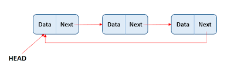
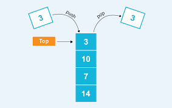
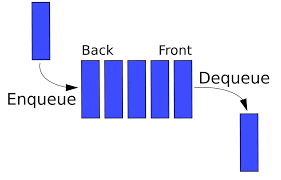
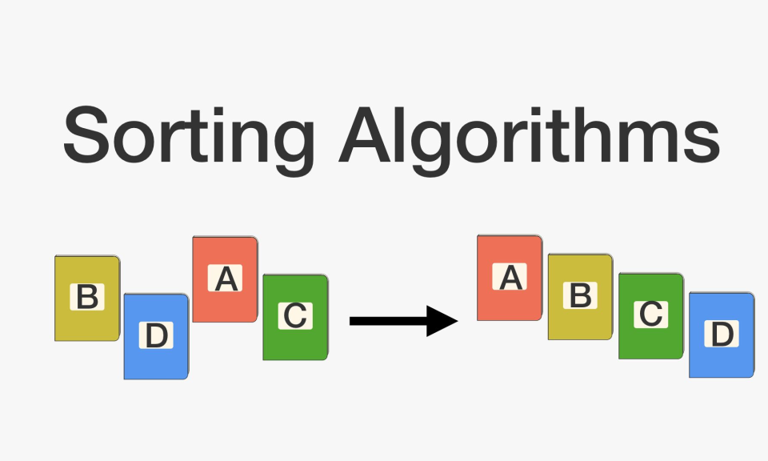
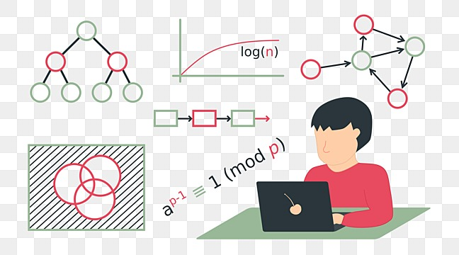
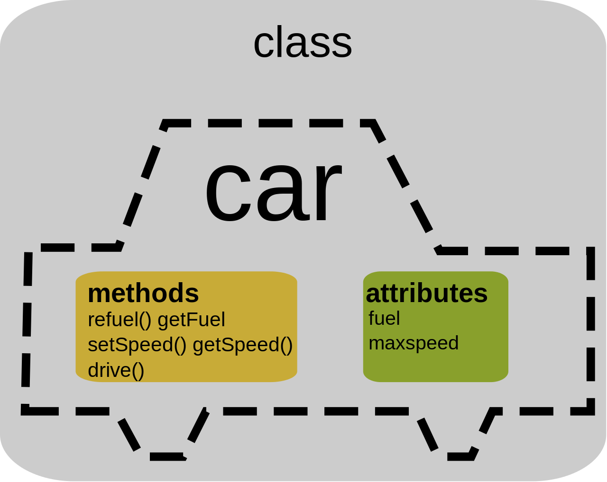

DSA WITH PYTHON && OOPS 
# Data Structures and Algorithms with Python

## Overview

This repository contains implementations of various data structures and algorithms in Python, along with explanations and examples. Whether you're a beginner or an experienced developer looking to brush up your skills, this repository aims to provide comprehensive resources to help you understand and implement DSA concepts efficiently.

## Contents

- [Data Structures](#data-structures)
- [Algorithms](#algorithms)
- [Object-Oriented Programming](#object-oriented-programming)
- [Contributing](#contributing)
- [License](#license)

## Data Structures

### 1. Linked List

Description: Linked list is a linear data structure where elements are not stored in contiguous memory locations. Each element points to the next element, forming a chain-like structure.

### 2. Stack

Description: Stack is a linear data structure that follows the Last-In-First-Out (LIFO) principle. Elements are added and removed from the same end, called the top.

### 3. Queue

Description: Queue is a linear data structure that follows the First-In-First-Out (FIFO) principle. Elements are added from the rear end and removed from the front end.

## Algorithms

### 1. Sorting Algorithms

Description: Sorting algorithms are used to rearrange elements in a specific order. Common sorting algorithms include Bubble Sort, Merge Sort, Quick Sort, etc.

### 2. Searching Algorithms

Description: Searching algorithms are used to find the location of a target value within a collection of elements. Common searching algorithms include Linear Search, Binary Search, etc.

## Object-Oriented Programming

### 1. Classes and Objects

Description: Object-oriented programming (OOP) is a programming paradigm based on the concept of "objects", which can contain data and code. Classes are blueprints for creating objects.

### 2. Inheritance

Description: Inheritance is a mechanism in which a new class inherits properties and behavior from an existing class. It promotes code reusability and establishes a relationship between classes.

## Contributing

Contributions are welcome! If you have any improvements or additional content to add, feel free to submit a pull request.

## License

This repository is licensed under the [MIT License](LICENSE).
